# kafka从入门到精通

## 1.kafka概述

### 1.1.kafka是什么

```shell
#kafka官网地址：
	http://kafka.apache.org/

	（中文社区：https://www.orchome.com/kafka/index）
	
	
#kafka是一个消息系统，消息中间件。是一个高吞吐量的分布式发布订阅消息系统。

#什么是消息中间件？
	1.在消息系统中，有两端：一端是生产消息的人（生产者）；一端是消费消息的人（消费者）
	2.正常情况：
		比如说生产者生产鸡蛋，每生产一个鸡蛋，消费者就消费（吃掉）一个鸡蛋。刚刚好，很美好！
	3.其它情况：
		消费者在吃鸡蛋过程中，被噎住了。还没吃完呢，生产者又生产好了下一个鸡蛋。怎么办？
		生产者每分钟生产10个鸡蛋，消费者每分钟消费2个鸡蛋。剩下8个鸡蛋。怎么办？
		
		有人说，给一个篮子，把剩下的鸡蛋，暂时先放到篮子中，让消费者慢慢吃。那么这个篮子就是消息中间件，就是kafka。
		

```

官网图：

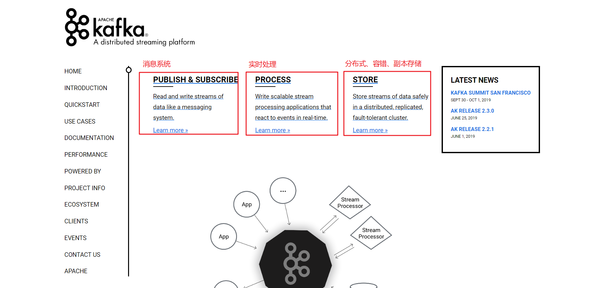


消息中间件图：

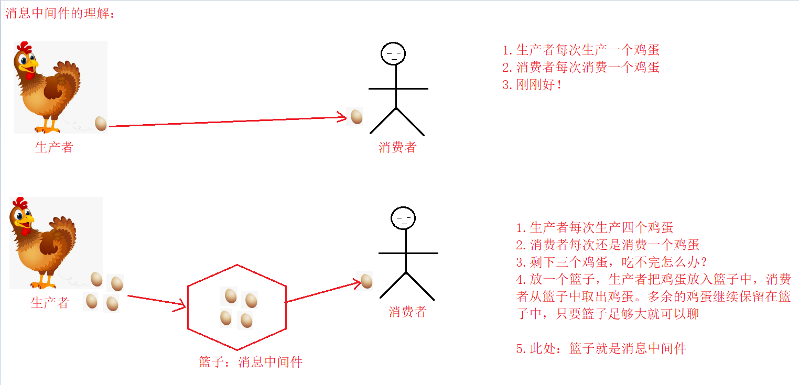


### 1.2.kafka角色介绍

| 角色              | 说明                                                         |
| ----------------- | ------------------------------------------------------------ |
| Broker            | Kafka集群包含一个或多个服务器，服务器即broker                |
| Topic             | 每条发布到Kafka集群的消息都有一个类别，类别即Topic           |
| Message           | 消息，有定长的消息头与变长的消息体组成                       |
| Partition         | Partition是物理上的概念，每个Topic包含一个或多个Partition    |
| Producer          | 消息生产者，负责发布消息到Kafka broker                       |
| Consumer          | 消息消费者，向Kafka broker读取消息的客户端                   |
| Consumer Group    | 每个Consumer属于一个特定的Consumer Group 。 如果没有指定group name，则属于默认的group |
| Group Coordinator | 每一个消费者组，会选择一个Broker作为协调者                   |

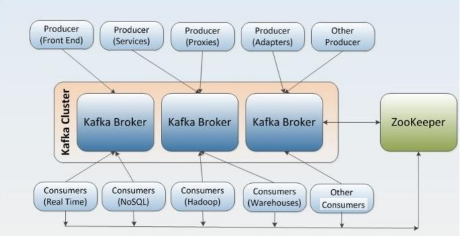


## 2.kafka集群环境搭建

### 2.1.集群主机规划

| 序号 | 机器名称                | ip/mac地址                        | 硬件资源                                           | 安装服务              |
| ---- | ----------------------- | --------------------------------- | -------------------------------------------------- | --------------------- |
| 1    | cdh1     root/server123 | 192.168.80.100，00:50:56:2B:5B:EF | cpu：2核 ， 内存：2.5g  ，硬盘20g ，网卡：千兆网卡 | jdk、zookeeper、kafka |
| 2    | cdh2     root/server123 | 192.168.80.101，00:50:56:39:23:67 | cpu：2核 ， 内存：2.5g  ，硬盘20g ，网卡：千兆网卡 | jdk、zookeeper、kafka |
| 3    | cdh3     root/server123 | 192.168.80.102，00:50:56:3E:3A:0B | cpu：2核 ， 内存：2.5g  ，硬盘20g ，网卡：千兆网卡 | jdk、zookeeper、kafka |

**说明：**集群主机之间需要配置ssh免密码登录


### 2.2.安装zookeeper集群

#### 2.2.1.下载zookeeper

```shell
#zookeeper官网地址：
	http://zookeeper.apache.org/
```

官网图：

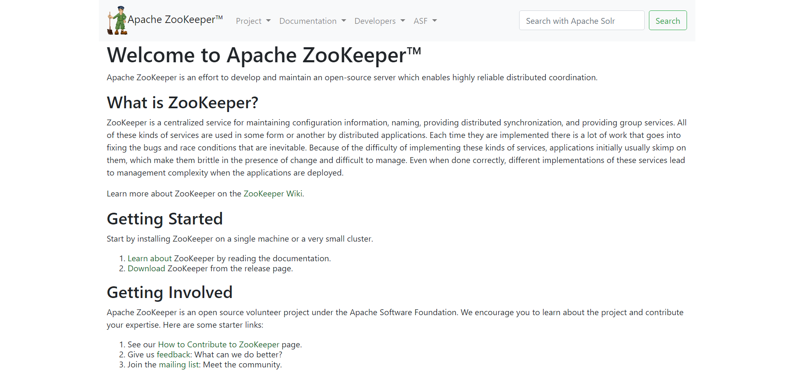


#### 2.2.2.上传解压

##### 上传

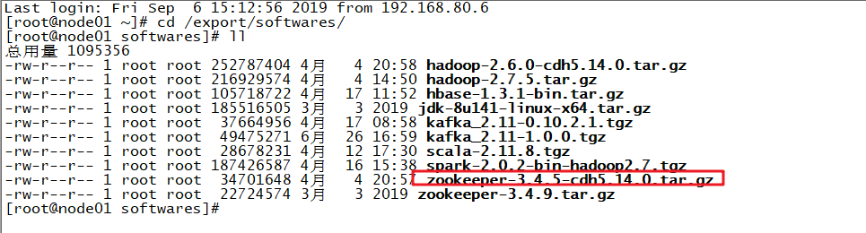

##### 解压

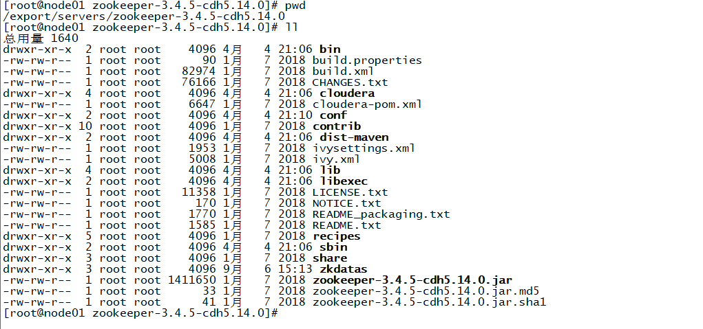


#### 2.2.3.配置

```shell
#进入目录：
	cd /export/servers/zookeeper-3.4.5-cdh5.14.0/conf
	
#编辑文件：
	vi zoo.cfg
	
----------------------------------------------------------------------------
# The number of milliseconds of each tick
#时间单元，zk中的所有时间都是以该时间单元为基础，进行整数倍配置
tickTime=2000
# The number of ticks that the initial
# synchronization phase can take
#follower在启动过程中，会从leader同步最新数据需要的最大时间。如果集群规模比较大，可以调大该参数
initLimit=10
# The number of ticks that can pass between
# sending a request and getting an acknowledgement
#leader与集群中所有机器进行心跳检查的最大时间。如果超出该时间，某follower没有回应，则说明该follower下线
syncLimit=5
# the directory where the snapshot is stored.
# do not use /tmp for storage, /tmp here is just
# example sakes.
#事务日志输出目录
dataDir=/export/servers/zookeeper-3.4.5-cdh5.14.0/zkdatas
# the port at which the clients will connect
#客户端连接端口
clientPort=2181
# the maximum number of client connections.
# increase this if you need to handle more clients
#maxClientCnxns=60
#
# Be sure to read the maintenance section of the
# administrator guide before turning on autopurge.
#
# http://zookeeper.apache.org/doc/current/zookeeperAdmin.html#sc_maintenance
#
# The number of snapshots to retain in dataDir
#需要保留文件数目，默认就是3个
autopurge.snapRetainCount=3
# Purge task interval in hours
# Set to "0" to disable auto purge feature
#自动清理事务日志和快照文件的频率，这里是1个小时
autopurge.purgeInterval=1

#集群服务器配置，数字1/2/3需要与myid文件一致。右边两个端口，2888表示数据同步和通信端口；3888表示选举端口
server.1=node01.hadoop.com:2888:3888
server.2=node02.hadoop.com:2888:3888
server.3=node03.hadoop.com:2888:3888

```

#### 2.2.4.创建数据目录和myid

```shell
#创建数据存储目录：
	mkdir -p /export/servers/zookeeper-3.4.5-cdh5.14.0/zkdatas

#创建myid:
	cd /export/servers/zookeeper-3.4.5-cdh5.14.0/zkdatas

	touch 1>myid
```


#### 2.2.5.分发到其它主机节点

```shell
#分发到node02节点，并修改myid内容为2：
	 scp -r zookeeper-3.4.5-cdh5.14.0/ node02:$PWD

#分发到node03节点，并修改myid内容为3：
	 scp -r zookeeper-3.4.5-cdh5.14.0/ node03:$PWD
	
```


#### 2.2.6.启动zookeeper集群

```shell
#分别在node01/node02/node03节点启动/停止：
	/export/servers/zookeeper-3.4.5-cdh5.14.0/bin/zkServer.sh start/stop
	
#查看集群状态：
	/export/servers/zookeeper-3.4.5-cdh5.14.0/bin/zkServer.sh status
```


### 2.3.安装kafka集群

#### 2.3.1.下载kafka

```shell
#kafka官网：
	http://kafka.apache.org/
	http://kafka.apache.org/downloads
```

官网图一：

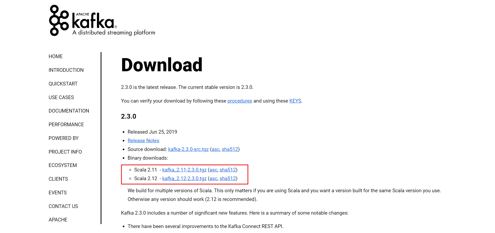


官网图二：

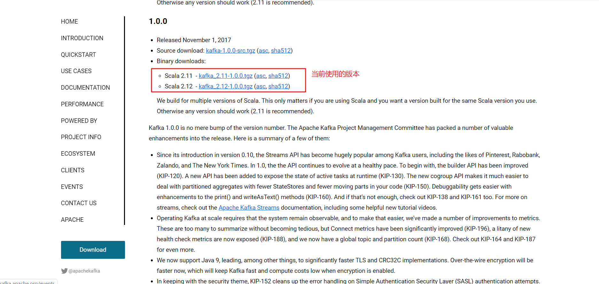


#### 2.3.2.上传解压

##### 上传

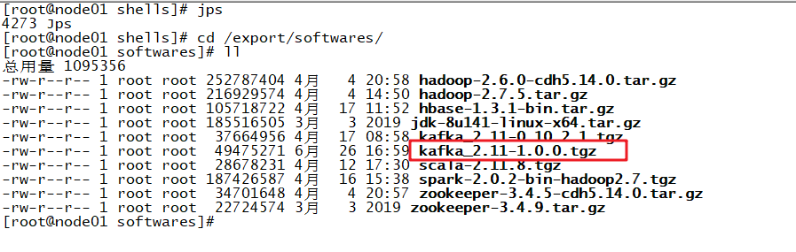

##### 解压

```shell
#解压到指定目录：
	tar -zxvf kafka_2.11-1.0.0.tgz -C ../servers/
```

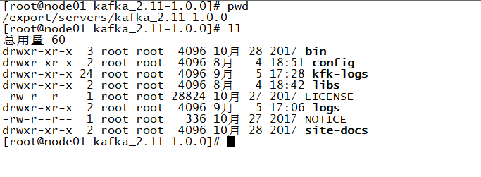


#### 2.3.3.配置

```shell
#进入目录：
	 cd /export/servers/kafka_2.11-1.0.0/config
	 
#编辑文件：
	 vi server.properties
------------------------------------------------------------------
# Licensed to the Apache Software Foundation (ASF) under one or more
# contributor license agreements.  See the NOTICE file distributed with
# this work for additional information regarding copyright ownership.
# The ASF licenses this file to You under the Apache License, Version 2.0
# (the "License"); you may not use this file except in compliance with
# the License.  You may obtain a copy of the License at
#
#    http://www.apache.org/licenses/LICENSE-2.0
#
# Unless required by applicable law or agreed to in writing, software
# distributed under the License is distributed on an "AS IS" BASIS,
# WITHOUT WARRANTIES OR CONDITIONS OF ANY KIND, either express or implied.
# See the License for the specific language governing permissions and
# limitations under the License.

# see kafka.server.KafkaConfig for additional details and defaults

############################# Server Basics #############################

# The id of the broker. This must be set to a unique integer for each broker.
#每个broker在集群中的唯一标识，不能重复
broker.id=0
#端口
port=9092
#broker主机地址
host.name=node01

############################# Socket Server Settings #############################

# The address the socket server listens on. It will get the value returned from
# java.net.InetAddress.getCanonicalHostName() if not configured.
#   FORMAT:
#     listeners = listener_name://host_name:port
#   EXAMPLE:
#     listeners = PLAINTEXT://your.host.name:9092
#listeners=PLAINTEXT://:9092

# Hostname and port the broker will advertise to producers and consumers. If not set,
# it uses the value for "listeners" if configured.  Otherwise, it will use the value
# returned from java.net.InetAddress.getCanonicalHostName().
#advertised.listeners=PLAINTEXT://your.host.name:9092

# Maps listener names to security protocols, the default is for them to be the same. See the config documentation for more details
#listener.security.protocol.map=PLAINTEXT:PLAINTEXT,SSL:SSL,SASL_PLAINTEXT:SASL_PLAINTEXT,SASL_SSL:SASL_SSL

# The number of threads that the server uses for receiving requests from the network and sending responses to the network
#broker处理消息的线程数
num.network.threads=3

# The number of threads that the server uses for processing requests, which may include disk I/O
#broker处理磁盘io的线程数
num.io.threads=8

# The send buffer (SO_SNDBUF) used by the socket server
#socket发送数据缓冲区
socket.send.buffer.bytes=102400

# The receive buffer (SO_RCVBUF) used by the socket server
#socket接收数据缓冲区
socket.receive.buffer.bytes=102400

# The maximum size of a request that the socket server will accept (protection against OOM)
#socket接收请求最大值
socket.request.max.bytes=104857600


############################# Log Basics #############################

# A comma seperated list of directories under which to store log files
#kafka数据存放目录位置，多个位置用逗号隔开
log.dirs=/export/servers/kafka_2.11-1.0.0/kfk-logs

# The default number of log partitions per topic. More partitions allow greater
# parallelism for consumption, but this will also result in more files across
# the brokers.
#topic默认的分区数
num.partitions=1

# The number of threads per data directory to be used for log recovery at startup and flushing at shutdown.
# This value is recommended to be increased for installations with data dirs located in RAID array.
#恢复线程数
num.recovery.threads.per.data.dir=1

############################# Internal Topic Settings  #############################
# The replication factor for the group metadata internal topics "__consumer_offsets" and "__transaction_state"
# For anything other than development testing, a value greater than 1 is recommended for to ensure availability such as 3.
#默认副本数
offsets.topic.replication.factor=1
transaction.state.log.replication.factor=1
transaction.state.log.min.isr=1

############################# Log Flush Policy #############################

# Messages are immediately written to the filesystem but by default we only fsync() to sync
# the OS cache lazily. The following configurations control the flush of data to disk.
# There are a few important trade-offs here:
#    1. Durability: Unflushed data may be lost if you are not using replication.
#    2. Latency: Very large flush intervals may lead to latency spikes when the flush does occur as there will be a lot of data to flush.
#    3. Throughput: The flush is generally the most expensive operation, and a small flush interval may lead to exceessive seeks.
# The settings below allow one to configure the flush policy to flush data after a period of time or
# every N messages (or both). This can be done globally and overridden on a per-topic basis.

# The number of messages to accept before forcing a flush of data to disk
#log.flush.interval.messages=10000

# The maximum amount of time a message can sit in a log before we force a flush
#log.flush.interval.ms=1000

############################# Log Retention Policy #############################

# The following configurations control the disposal of log segments. The policy can
# be set to delete segments after a period of time, or after a given size has accumulated.
# A segment will be deleted whenever *either* of these criteria are met. Deletion always happens
# from the end of the log.

# The minimum age of a log file to be eligible for deletion due to age
#消息日志最大存储时间，这里是7天
log.retention.hours=168

# A size-based retention policy for logs. Segments are pruned from the log unless the remaining
# segments drop below log.retention.bytes. Functions independently of log.retention.hours.
#log.retention.bytes=1073741824

# The maximum size of a log segment file. When this size is reached a new log segment will be created.
#每个日志段文件大小，这里是1g
log.segment.bytes=1073741824

# The interval at which log segments are checked to see if they can be deleted according
# to the retention policies
#消息日志文件大小检查间隔时间
log.retention.check.interval.ms=300000

############################# Zookeeper #############################

# Zookeeper connection string (see zookeeper docs for details).
# This is a comma separated host:port pairs, each corresponding to a zk
# server. e.g. "127.0.0.1:3000,127.0.0.1:3001,127.0.0.1:3002".
# You can also append an optional chroot string to the urls to specify the
# root directory for all kafka znodes.
#zookeeper集群地址
zookeeper.connect=node01:2181,node02:2181,node03:2181

# Timeout in ms for connecting to zookeeper
#zookeeper连接超时时间
zookeeper.connection.timeout.ms=6000


############################# Group Coordinator Settings #############################

# The following configuration specifies the time, in milliseconds, that the GroupCoordinator will delay the initial consumer rebalance.
# The rebalance will be further delayed by the value of group.initial.rebalance.delay.ms as new members join the group, up to a maximum of max.poll.interval.ms.
# The default value for this is 3 seconds.
# We override this to 0 here as it makes for a better out-of-the-box experience for development and testing.
# However, in production environments the default value of 3 seconds is more suitable as this will help to avoid unnecessary, and potentially expensive, rebalances during application startup.
group.initial.rebalance.delay.ms=0
```


#### 2.3.4.创建数据存储目录

```shell
#创建数据存储目录：
	mkdir -p /export/servers/kafka_2.11-1.0.0/kfk-logs
	
```


#### 2.3.5.分发到其它主机节点

```shell
#分发到node02节点：
	scp -r kafka_2.11-1.0.0/ node02:$PWD

#分发到node03节点：
	scp -r kafka_2.11-1.0.0/ node03:$PWD
	
```


#### 2.3.6.修改其它节点配置文件

```shell
#node02节点
cd /export/servers/kafka_2.11-1.0.0/config

vi server.properties
----------------------------------------------------
# The id of the broker. This must be set to a unique integer for each broker.
broker.id=1
port=9092
host.name=node02

#node03节点
cd /export/servers/kafka_2.11-1.0.0/config

vi server.properties
----------------------------------------------------
# The id of the broker. This must be set to a unique integer for each broker.
broker.id=2
port=9092
host.name=node03
```


#### 2.3.6.启动kafka集群

```shell
#分别在三台节点执行：node01/node02/node03
 ##启动kafka集群
/export/servers/kafka_2.11-1.0.0/bin/kafka-server-start.sh -daemon /export/servers/kafka_2.11-1.0.0/config/server.properties

 ## 停止kafka集群
/export/servers/kafka_2.11-1.0.0/bin/kafka-server-stop.sh
```


## 3.kafka基本使用

### 3.1.交互式命令使用

#### 查看topic

```shell
#查看topic 列表：
	/export/servers/kafka_2.11-1.0.0/bin/kafka-topics.sh --list --zookeeper node01:2181,node02:2181,node03:2181
	
#查看指定topic：
/export/servers/kafka_2.11-1.0.0/bin/kafka-topics.sh  --describe --zookeeper node01:2181,node02:2181,node03:2181 --topic itcast_topic
	
#创建topic
# --create：表示创建
# --zookeeper 后面的参数是zk的集群节点
# --replication-factor 1 ：表示复本数
# --partitions 1：表示分区数
# --topic itheima_topic：表示topic的主题名称

/export/servers/kafka_2.11-1.0.0/bin/kafka-topics.sh --create --zookeeper node01:2181,node02:2181,node03:2181 --replication-factor 1 --partitions 1 --topic oc_itheima_topic

#删除topic
/export/servers/kafka_2.11-1.0.0/bin/kafka-topics.sh --delete --zookeeper node01:2181,node02:2181,node03:2181 --topic itheima_topic

```


#### 创建生产者

```shell
#创建生产者，生产消息
/export/servers/kafka_2.11-1.0.0/bin/kafka-console-producer.sh --broker-list node01:9092,node02:9092,node03:9092 --topic oc_itheima_topic
```


#### 创建消费者

```shell
#创建消费者，消费消息：
/export/servers/kafka_2.11-1.0.0/bin/kafka-console-consumer.sh --bootstrap-server node01:9092,node02:9092,node03:9092 --topic oc_itheima_topic --consumer-property group.id=my-consumer-g  --partition 0 --offset 0
```


### 3.2.java api使用

#### 创建项目

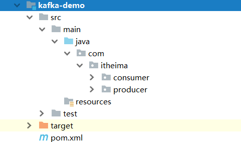

#### 配置pom.xml

```xml
<?xml version="1.0" encoding="UTF-8"?>
<project xmlns="http://maven.apache.org/POM/4.0.0"
         xmlns:xsi="http://www.w3.org/2001/XMLSchema-instance"
         xsi:schemaLocation="http://maven.apache.org/POM/4.0.0 http://maven.apache.org/xsd/maven-4.0.0.xsd">
    <modelVersion>4.0.0</modelVersion>

    <groupId>com.itheima</groupId>
    <artifactId>kafka-demo</artifactId>
    <version>1.0-SNAPSHOT</version>

    <packaging>jar</packaging>

    <properties>
        <kafka.version>1.0.0</kafka.version>
    </properties>

    <dependencies>
        <dependency>
            <groupId>org.apache.kafka</groupId>
            <artifactId>kafka_2.11</artifactId>
            <version>${kafka.version}</version>
        </dependency>
    </dependencies>

    
</project>
```


#### 生产者

```java
package com.itheima.producer;

import org.apache.kafka.clients.producer.Callback;
import org.apache.kafka.clients.producer.KafkaProducer;
import org.apache.kafka.clients.producer.ProducerRecord;
import org.apache.kafka.clients.producer.RecordMetadata;

import java.util.Properties;
import java.util.concurrent.Future;

/**
 * kafka客户端之：生产者
 */
public class MyKafkaProducer {

    public static void main(String[] args) throws Exception{
        // 1.配置信息
        Properties props = new Properties();
        // 定义kafka服务器地址列表，不需要指定所有的broker
        props.put("bootstrap.servers", "node01:9092,node02:9092,node03:9092");
        //  生产者需要leader确认请求完成之前接收的应答数
        props.put("acks", "-1");
        // 客户端失败重试次数
        props.put("retries", 1);
        // 生产者打包消息的批量大小，以字节为单位.此处是16k
        props.put("batch.size", 16384);
        // 生产者延迟1ms发送消息
        props.put("linger.ms", 1);
        // 生产者缓存内存的大小，以字节为单位.此处是32m
        props.put("buffer.memory", 33554432);
        // key 序列化类
        props.put("key.serializer", "org.apache.kafka.common.serialization.StringSerializer");
        // value序列化类
        props.put("value.serializer", "org.apache.kafka.common.serialization.StringSerializer");

        // 2.创建生产者
        KafkaProducer<String,String> producer = new KafkaProducer<String, String>(props);

        // 3.生产数据
        /**
         * 发送消息的三种方式：
         *      1.同步阻塞发送
         *          适用场景：业务不需要高吞吐量、更关心消息发送的顺序、不允许消息发送失败
         *      2.异步发送（发送并忘记）
         *          适用场景：业务只关心吞吐量、不关心消息发送的顺序、可以允许消息发送失败
         *      3.异步发送（回调函数）
         *          适用场景：业务需要知道消息发送成功、不关心消息发送的顺序
         */

        // 1.同步阻塞发送
        // 创建消息
       /* System.out.println("-------------------同步发送消息......start-----------------------");
        ProducerRecord<String,String> record = new ProducerRecord<String, String>("itheima_topic",0,"key-sync","同步发送消息");

        Future<RecordMetadata> send = producer.send(record);
        RecordMetadata recordMetadata = send.get();
        System.out.println(recordMetadata);

        System.out.println("-------------------同步发送消息......end-----------------------");*/

        // 2.异步发送（发送并忘记）
        // 创建消息
        /*System.out.println("-------------------异步发送（发送并忘记）......start-----------------------");
        ProducerRecord<String,String> record = new ProducerRecord<String, String>("itheima_topic",0,"key-async1","异步发送消息，发送并忘记");

        // 发送并忘记
        producer.send(record);

        System.out.println("-------------------异步发送（发送并忘记）......end-----------------------");

        // 刷新
        producer.flush();*/

        // 3.异步发送（回调函数）
        // 创建消息
        System.out.println("-------------------异步发送（回调函数）......start-----------------------");
        ProducerRecord<String,String> record = new ProducerRecord<String, String>("itheima_topic",0,"key-async2","异步发送消息，（回调函数）");

        // 发送，回调函数处理
        producer.send(record, new Callback() {
            // 处理回调业务逻辑
            public void onCompletion(RecordMetadata recordMetadata, Exception e) {
                System.out.println("异步发送消息成功："+recordMetadata);
                System.out.println("异常对象："+e);
            }
        });

        System.out.println("-------------------异步发送（回调函数）......end-----------------------");

        // 刷新
        producer.flush();

    }
}

```


#### 消费者

```java
package com.itheima.consumer;

import org.apache.kafka.clients.consumer.ConsumerRecord;
import org.apache.kafka.clients.consumer.ConsumerRecords;
import org.apache.kafka.clients.consumer.KafkaConsumer;
import org.apache.kafka.clients.consumer.OffsetAndMetadata;
import org.apache.kafka.common.TopicPartition;

import java.util.Arrays;
import java.util.Properties;

/**
 * kafka客户端之：消费者
 */
public class MyKafkaConsumer {

    public static void main(String[] args) throws Exception{
        // 1.配置信息
        Properties props = new Properties();
        // 定义kafka服务器地址列表，不需要指定所有的broker
        props.put("bootstrap.servers", "node01:9092,node02:9092,node03:9092");
        // 消费者组id
        props.put("group.id", "itheima");
        // 是否自动确认offset
        props.put("enable.auto.commit", "true");
        //自动确认offset时间间隔
        props.put("auto.commit.interval.ms", "1000");

        // key 序列化类
        props.put("key.deserializer", "org.apache.kafka.common.serialization.StringDeserializer");
        // value序列化类
        props.put("value.deserializer", "org.apache.kafka.common.serialization.StringDeserializer");

        // 2.创建消费者
        KafkaConsumer<String,String> consumer = new KafkaConsumer<String, String>(props);

        // 3.消费消息
        // 指定分区消费
        TopicPartition partition = new TopicPartition("itheima_topic",0);

        // 获取已经提交的偏移量
        long offset = 0L;
        OffsetAndMetadata offsetAndMetadata = consumer.committed(partition);
        if(offsetAndMetadata !=null){
            offset = offsetAndMetadata.offset();
        }
        System.out.println("当前消费的偏移量："+offset);

        // 指定偏移量消费
        consumer.assign(Arrays.asList(partition));
        consumer.seek(partition,offset);

        // 循环拉取数据
        while (true){
           // 拉取数据
            ConsumerRecords<String, String> records = consumer.poll(1000);

            // 打印数据
            for (ConsumerRecord<String, String> record : records) {
                System.out.println("消费的数据为：" + record.value());
            }

        }
    }
}

```


## 4.kafka原理

### 4.1.消息存储和查询机制

#### 4.1.1.消息存储机制	

##### topic

```shell
#关于类别topic:
	1.每条发布到kafka集群的消息都有一个类别，该类别就是topic
```


##### partition

```shell
#关于分区partition:
	1.partition是物理上的概念，每个topic包含一个或者多个partition
	2.每个分区由一系列有序的不可变的消息组成，是一个有序队列
	3.每个分区在物理上是一个文件夹，分区命名规则：${topicName}-${partitionId}。比如：itheima_topic-0
	4.分区目录下，存储该分区的日志段。包含一个数据文件和两个索引文件
	5.每条消息被追加到对应的分区中，是顺序写磁盘。这也是kafka高吞吐量的重要保证
	6.kafka是局部有序，即只保证一个分区内的消息有序性，不保证全局有序
```

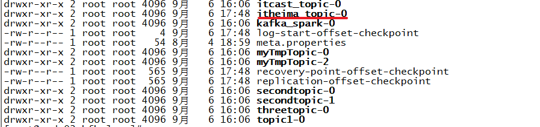


##### logSegment

```shell
#关于日志段logSegment：
	1.日志文件按照大小、或者时间滚动，切分成一个或者多个日志段（logSegment）
		日志段大小默认1GB，配置参数：log.segment.bytes
		时间长度配置参数：log.roll.ms、或者log.roll.hours
	2.kafka的日志段：
		由一个日志文件：
			00000000000000000000.log
		两个索引文件：
			00000000000000000000.index
			00000000000000000000.timeindex
	3.数据文件：
		数据文件以.log为后缀，保存实际消息数据
		命名规则：数据文件的第一条消息偏移量（基准偏移量：BaseOffset），左补0构成20位数字字符组成
		基准偏移量是上一个数据文件的LEO+1。LEO（Log End Offset）
		
	4.偏移量索引文件：
		文件名称与数据文件名称相同，以.index作为后缀。用于快速根据偏移量定位到消息所在的位置
		
	5.时间戳索引文件：
		文件名称与数据文件名称相同，以.timeindex作为后缀。用于根据时间戳快速定位到消息所在的位置
		
```

**关于日志段文件：**

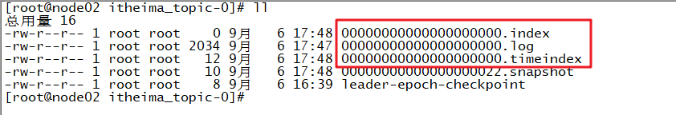

**关于偏移量：**

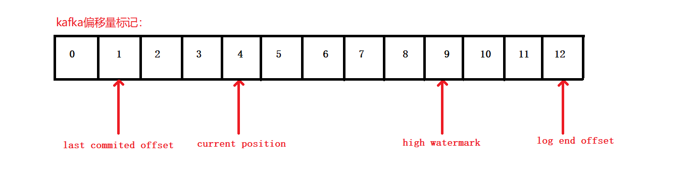


#### 4.1.2.消息查询机制

```shell
#读取offset=368776的消息，需要通过两个步骤完成：
	查找segment file
	通过segment file 查找message
```

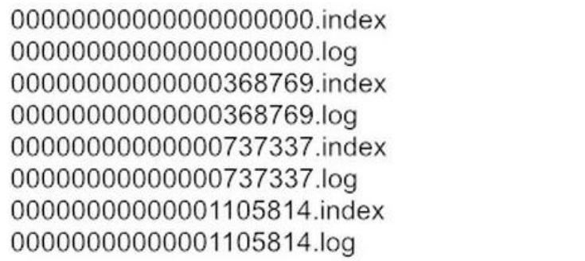

##### 查找segment file

```shell
#文件偏移量：
	1. 最开始的文件：00000000000000000000.index，起始偏移量(offset)为 0
	2.00000000000000368769.index，消息起始偏移量：368770 = 368769 + 1
	3.00000000000000737337.index，消息起始偏移量：737338=737337 + 1
	4.后续文件以此类推
	
#查找过程：
	1.根据起始偏移量，文件有序。
	2.通过二分查找，快速定位到当前offset对应的文件。比如：
		当 offset=368776 ，定位到 00000000000000368769.index 和对应 log 文件
```


##### 通过segment file 查找message

```shell
#偏移量在.index文件存储：
	kafka并不是每条消息都对应有索引（在.index进行存储）。而是采取了稀疏存储的方式，每个一定字节的数据建立一条索引。索引跨度通过参数配置：index.interval.bytes

#查找过程：
	1.根据当前目标偏移量，通过二分查找，查找值小于等于目标偏移量的最大偏移量
	2.从查找到的最大偏移量开始，顺序扫描数据文件，直到在数据文件中找到偏移量，与目标偏移量相等的消息
	
```


### 4.2.生产者数据分发策略与发送数据方式

#### 4.3.1.数据分发策略

```java
#关于生产者数据分发策略：
	1.在kafka中一个topic下，有一个或者多个partition。那么当Producer向kafka写入数据的时候，如何决定数据该写入哪一个partition中呢？
	2.分三种情况：
		2.1.Producer将数据发送到指定分区：
			
			/**
			*创建消息对象 0 1 2
			*参数说明：
			*	topic：指定类别
			*	partition：指定分区
			*	key：数据的key
			*	value：数据值value
			*/
			 public ProducerRecord(String topic, Integer partition, K key, V value) {
        		this(topic, partition, (Long)null, key, value, (Iterable)null);
    		  }
    		  
		2.2.如果没有明确指定分区：
			2.2.1.数据不是k/v对数据，采取轮询的策略。比如有三个分区：0,1,2。则将数据对应按照0,1,2,0,1,2......轮询方式写入分区
			2.2.2.数据是k/v对数据，采取计算k的哈希值，将k哈希值%可用分区数=当前分区。决定将数据写入到对应的分区
```

**源码参考：**

```java
// 默认分区类：
public class DefaultPartitioner implements Partitioner {
    
    // 获取目标分区
    public int partition(String topic, Object key, byte[] keyBytes, Object value, byte[] valueBytes, Cluster cluster) {
        // 获取当前topic所有的分区
        List<PartitionInfo> partitions = cluster.partitionsForTopic(topic);
        // 获取到总的分区数量
        int numPartitions = partitions.size();
        // 判断当前消息是否有key，如果没有key的话，采取的是轮训策略
        if (keyBytes == null) {
            int nextValue = this.nextValue(topic);
            List<PartitionInfo> availablePartitions = cluster.availablePartitionsForTopic(topic);
            if (availablePartitions.size() > 0) {
                int part = Utils.toPositive(nextValue) % availablePartitions.size();
                return ((PartitionInfo)availablePartitions.get(part)).partition();
            } else {
                return Utils.toPositive(nextValue) % numPartitions;
            }
        } else {
            // 如果当前的消息是有key的，把当前的key求hash值，再跟总的分区数量求余，决定把数据写入哪一个分区
            return Utils.toPositive(Utils.murmur2(keyBytes)) % numPartitions;
        }
    }

    // 轮询策略，获取下一个分区
    private int nextValue(String topic) {
        AtomicInteger counter = (AtomicInteger)this.topicCounterMap.get(topic);
        if (null == counter) {
            counter = new AtomicInteger(ThreadLocalRandom.current().nextInt());
            AtomicInteger currentCounter = (AtomicInteger)this.topicCounterMap.putIfAbsent(topic, counter);
            if (currentCounter != null) {
                counter = currentCounter;
            }
        }

        return counter.getAndIncrement();
    }
        
}

```


#### 4.3.2.发送数据方式

```shell
#关于数据发送方式：
	1.同步阻塞发送：
		适用场景：
			业务不需要高吞吐量、更关心消息发送的顺序、不允许消息发送失败
		参考代码：
			图一
        
	2.异步发送（发送并忘记）：
		适用场景：
			业务只关心吞吐量、不关心消息发送的顺序、可以允许消息发送失败
		参考代码：
			图二
		
	3.异步发送（回调函数）:
		适用场景：
			业务需要知道消息发送成功、不关心消息发送的顺序
		参考代码：
			图三
```

图一：同步阻塞发送

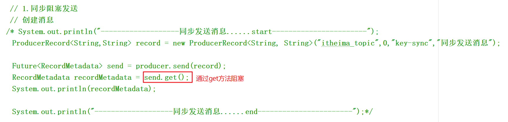


图二：异步发送（发送并忘记）

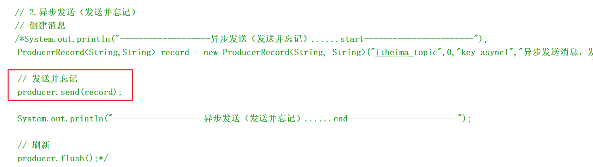


图三：异步发送（回调函数）

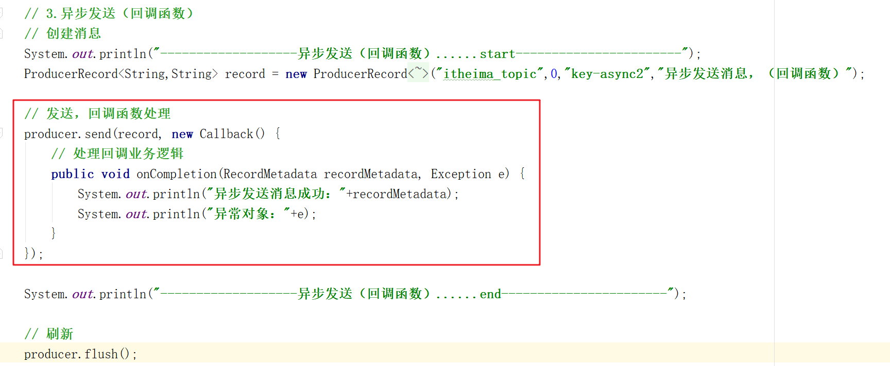


### 4.3.消费者负载均衡策略

```shell
#关于消费者平衡过程：
	1.消费者平衡（Consumer rebalance）指消费者重新加入消费组，并重新分配分区给消费者的过程
	2.会引起消费者平衡的情况：
		2.1.新的消费者加入消费组
		2.2.某个消费者从消费组退出（不管是异常退出，还是正常关闭）
		2.3.增加订阅主题的分区（kafka的分区数，可以动态增加，但不能减少）
		2.4.某台broker宕机，新的协调器当选
		2.5.某个消费者在心跳会话时间内没有发送心跳请求（配置参数：session.timeout.ms），组协调器认为消费者已经退出

#关于消费者与partition对应关系：
	1.如果有三个partition：p0/p1/p2，同一个消费组有三个消费者：c0/c1/c2。则为一一对应关系
	2.如果有三个partition：p0/p1/p2，同一个消费组有两个消费者：c0/c1。则其中一个消费者消费两个分区的数据；另外一个消费者消费一个分区的数据
	3.如果有两个partition：p0/p1，同一个消费组有三个消费者：c0/c1/c2。则有一个消费者为空闲，另外两个消费者分别各自消费一个分区的数据
	
	--总的来说，同一个分区的数据，只能被一个消费组中的一个消费者消费
	
```

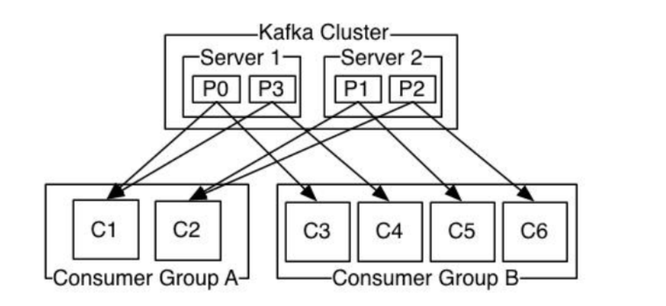


