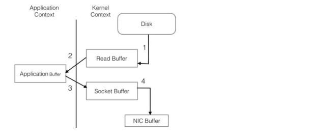
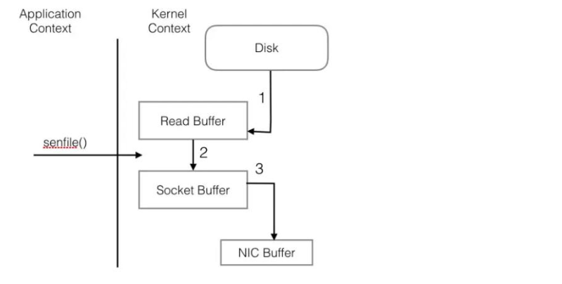
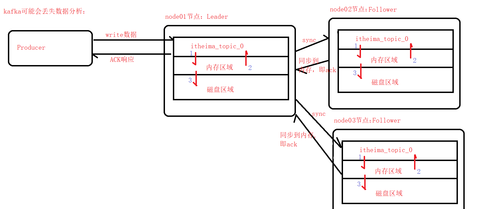

# kafka常见面试题

## 1.kafka面试题

### 1.1.kafka的高吞吐量是如何实现的？

```shell
#关于kafka的高吞吐量：
	1.顺序写磁盘（Sequence I/O）：
		kafka根据消息读写的特殊性，通过Sequence I/O规避了磁盘速度低下对性能造成的影响。关于磁盘I/O性能，官方给出的测试数据（Raid-5,7200rpm）：
		Sequence I/O:600MB/s
		Random I/O:100KB/s
		
	2.Sendfile技术：
		除了Sequence I/O提升写磁盘性能，kafka还通过sendfile技术优化了网络I/O流程。
		传统网络I/O操作流程：
			1.OS从硬盘读取数据到内核区的PageCache
			2.用户进程从内核区Copy数据到用户区
			3.用户进程把数据写入到Socket，数据流入到内核区的Socket Buffer上
			4.OS再把数据从Buffer，Copy到网卡Buffer
			
		sendfile优化后网络I/O操作流程：
			1.OS从硬盘读取数据到内核区PageCache
			2.通过sendfile技术，不需要将数据Copy到用户区，直接把数据流入到内核区的Socket Buffer
			3.OS从内核区的Socket Buffer，把数据Copy到网卡Buffer
```

**传统网络I/O操作流程：**




**sendfile优化后网络I/O操作流程：**




### 1.2.kafka的高可用是如何实现的？

```shell
#关于kafka的高可用：
	1.数据副本机制（Data replication）
	2.主选举（Leader Election）
```


### 1.3.kafka生产者发送数据有几种方式？

```shell
#关于Producer发送数据方式：
	1.同步并阻塞发送：
		适用场景：业务不需要高吞吐量、更关心消息发送的顺序、不允许消息发送失败
		
	2.异步发送（发送并忘记）：
		适用场景：业务只关心吞吐量、不关心消息发送的顺序、可以允许消息发送失败
		
	3.异步发送（回调函数）：
		适用场景：业务需要知道消息发送成功、不关心消息发送的顺序
	
```

### 1.4.kafka消费者负载均衡是什么？

```shell
#关于kafka的消费者负载均衡：
	1.消费者负载均衡，指消费组中的消费者，与Topic中的partition对应关系
	2.有以下几种对应关系：
		2.1.如果有三个partition：p0/p1/p2，同一个消费组有三个消费者：c0/c1/c2。则为一一对应关系
		2.2.如果有三个partition：p0/p1/p2，同一个消费组有两个消费者：c0/c1。则其中一个消费者消费两个分区的数据；另外一个消费者消费一个分区的数据
		2.3.如果有两个partition：p0/p1，同一个消费组有三个消费者：c0/c1/c2。则有一个消费者为空闲，另外两个消费者分别各自消费一个分区的数据
		
```

### 1.5.kafka偏移量是如何管理的？

```shell
#关于kafka偏移量管理：
	1.消费者读取消息是基于偏移量offset进行的。如果offset出错，则可能导致重复消费数据，或者跳过数据
	2.在0.8.2之前版本，kafka是将offset保存在zookeeper中。由于zookeeper本身的写操作非常昂贵，而且不能线性扩展（写单点），导致频繁写入zookeeper会有性能瓶颈
	3.从0.8.2版本以后，引入了OffsetManagent，将offset保存在kafka的topic中（_consumer_offsets），Consumer通过发送OffsetCommitRequest请求，到指定的broker(偏移量管理者)提交偏移量，保存在_consumer_offsets对应的分区中
	4.同时为了提高性能，kafka在内存中也会维护一份最近的偏移量记录。不需要每次都扫描全部偏移量日志，来获取offset
	
	--偏移量，由消费者进行提交管理
```

### 1.6.为什么说kafka可能会丢失数据？

```shell
#关于kafka可能丢失数据：
	1.kafka是通过Data Replication，与Leader Election实现高可用
	2.在多副本情况下，一个partition有多个副本，其中分为一个Leader，与多个Follower
	3.在Producer发送数据的时候，配合ACK机制：
		0：不需要应答
		1：当Leader收到数据，即给出应答
		-1：当Leader收到数据，并且ISR中的所有Follower同步数据后，给出应答
		
	4.需要注意：
		如果ACK=-1，虽然是所有ISR中的Follower都同步数据完成，并且给出了应答。但这个时候Follower并没有把数据持久化，而是将数据同步到内存后，即给出应答。假如此时Follower宕机，则会造成丢失数据（不能保证该条消息，一定会被Consumer消费）。
```

图：

